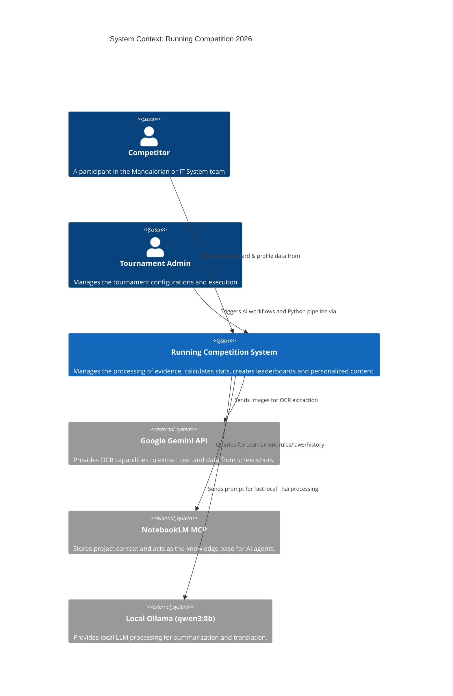
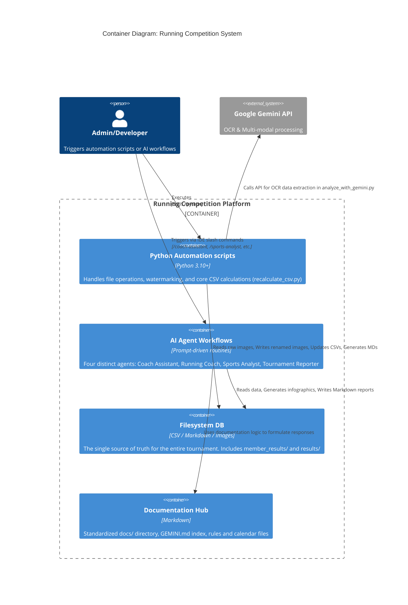

# C4 Architecture Diagrams

These diagrams map out the architecture of the **Running Competition 2026** system. Our "Filesystem-as-Source-of-Truth" approach shifts complex database systems into simple file structures managed by either Python automation or autonomous AI workflows.

---

## 1. Context Diagram

The System Context diagram provides a high-level overview of how the users (runners and administrators) interact with the core Running Competition System and its external dependencies.

---

## 2. Container Diagram

The Container diagram zooms into the **Running Competition System** to show its core architectural components.

