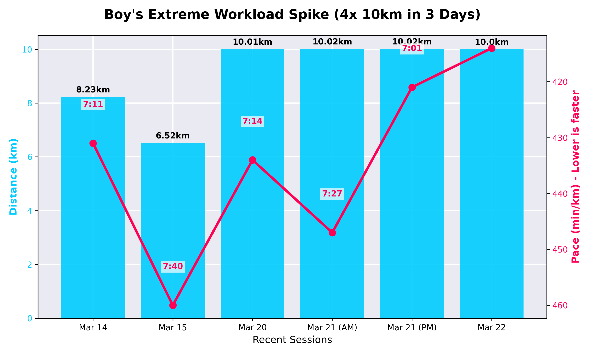

# 🏅 Daily Performance Report — 2026-03-22
**Activity:** Afternoon Run
**Distance:** 10.00 km
**Pace:** 6:54 /km

## 📌 Coach's Daily Take
ระยะ 10km ยังคงทำได้อย่างต่อเนื่อง และวันนี้กดเพซลงมาต่ำกว่า 7 นาทีต่อกิโลเมตรได้อีกครั้ง! (6:54/km) แสดงให้เห็นถึงความทนทานของกล้ามเนื้อที่เริ่มจำเพซนี้ได้แล้วครับ ถือเป็นความสม่ำเสมอในระดับที่ยอดเยี่ยม

**⚠️ Workload Warning (คำเตือนด้านโอเวอร์เทรนนิ่ง):**
การวิ่งระยะใกล้ๆ หรือเทียบเท่า 10km ติดต่อกันถึง 4 เซสซั่นในเวลา 3 วัน (20-22 มี.ค.) ถือเป็นการ Load ร่างกายส่วนล่างที่หนักมาก โค้ชขอแนะนำให้พักการวิ่งอย่างน้อย 1-2 วันเพื่อซ่อมแซมกล้ามเนื้อ การเร่งเครื่องมากเกินไปอาจทำให้เกิดอาการเจ็บสะสมได้ สุขภาพมาก่อนสถิตินะครับพี่บอย!
