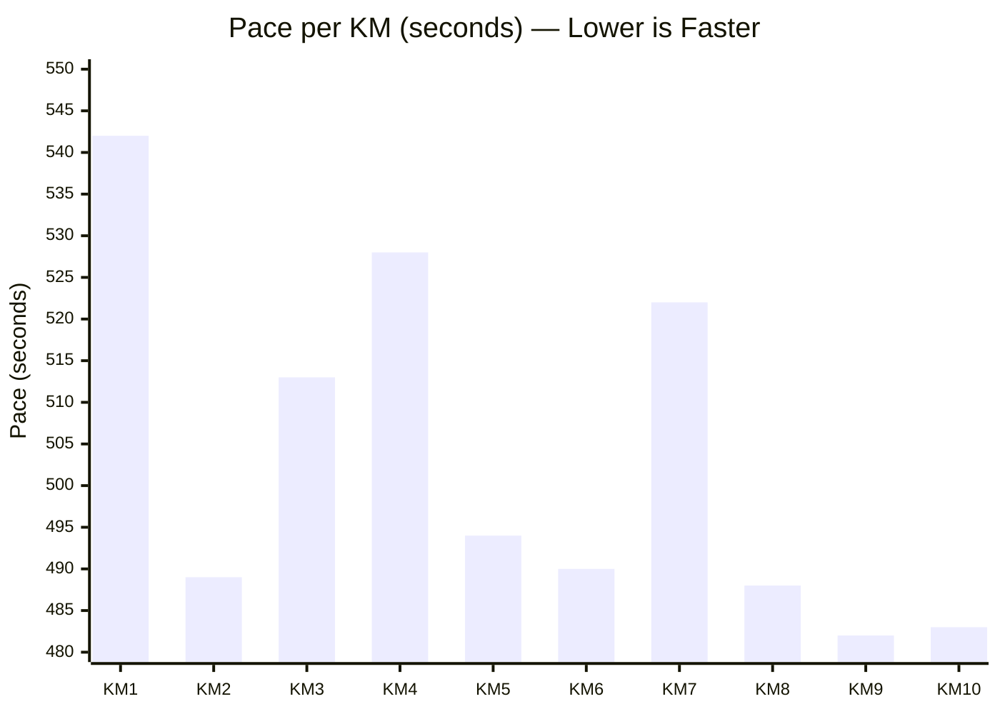
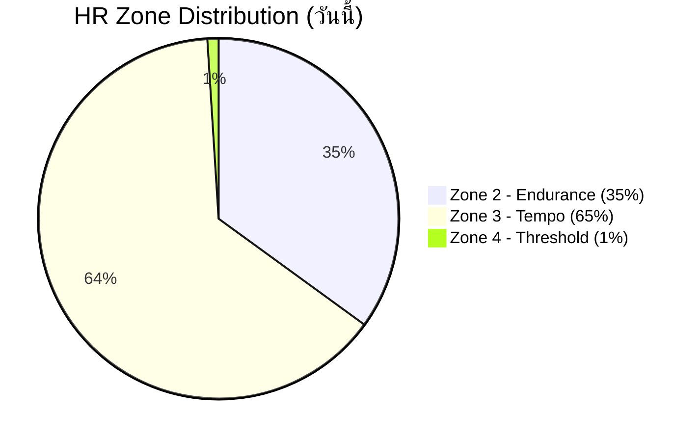
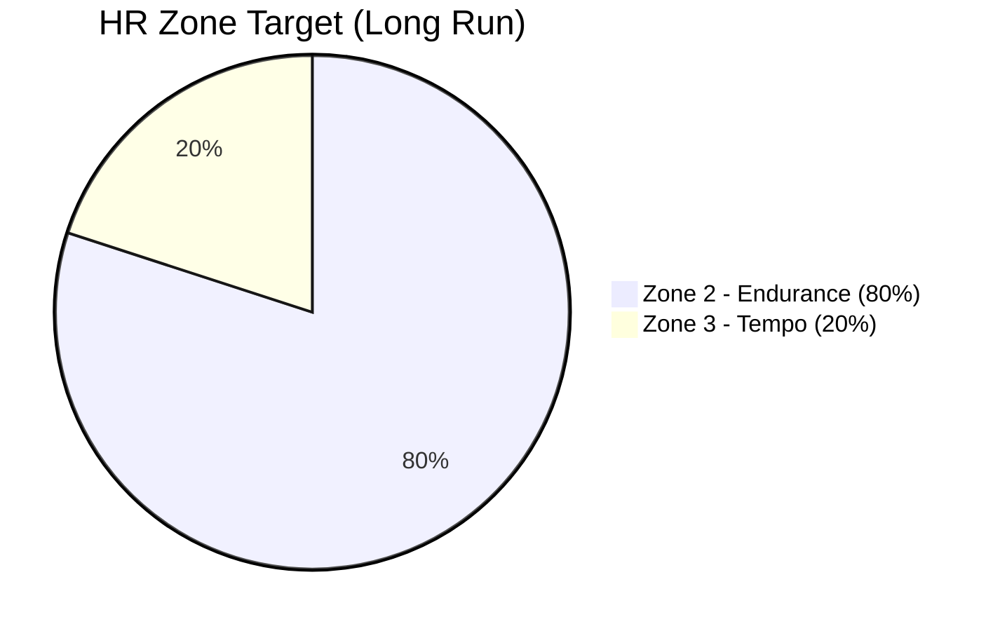
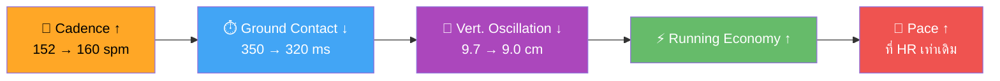
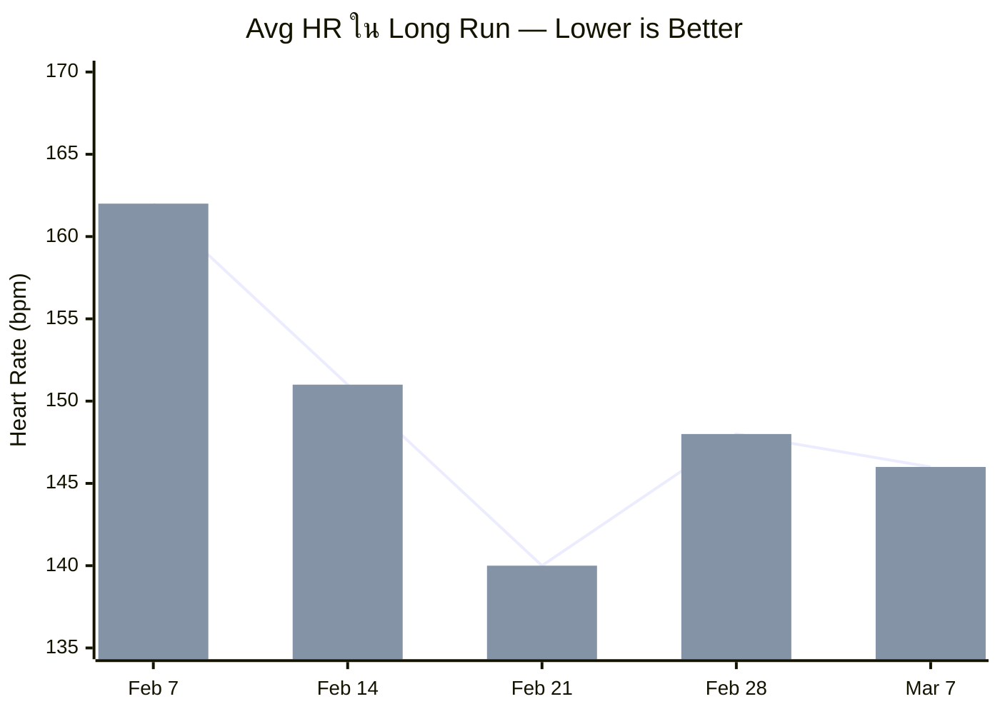
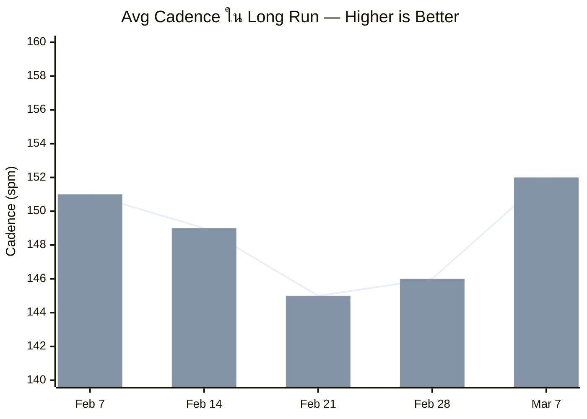
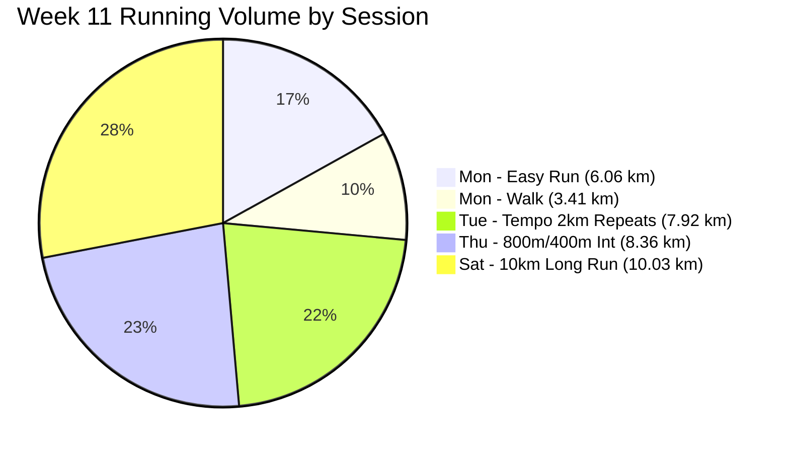
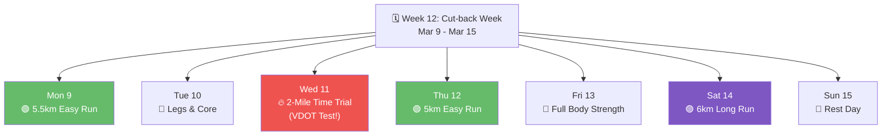
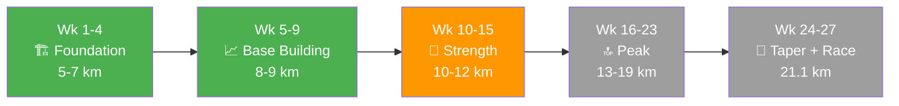

# 🏃🏻‍♂️ Performance Summary — GIO | 10km Long Run
📅 **7 มีนาคม 2026** | 🗓️ Week 11 (Strength Phase) | 📍 Bang Su Khwaeng, Nonthaburi

---

## 📊 Overview

| Metric | Value |
|---|---|
| **Activity** | 10km Long Run (Runna Half Marathon Plan — Week 11) |
| **Distance** | 10.03 km |
| **Time** | 1:24:11 |
| **Avg Pace** | 8:23/km |
| **Max Pace** | 7:16/km |
| **Avg HR** | 146 bpm |
| **Max HR** | 158 bpm |
| **HR Zones** | Z2: 35% (29:06) · Z3: 65% (54:20) · Z4: 1% (0:29) |
| **Avg Cadence** | 152 spm |
| **Max Cadence** | 162 spm |
| **Avg Power** | 157 W |
| **Max Power** | 180 W |
| **Elevation Gain** | 0 m (Max: 6 m) |
| **ยอดสะสมรวม** | **340.58 km** (51 days, 62 sessions) |

---

## 🏅 Personal Records (Runna)

| Distance | Best Time |
|---|---|
| 🥇 1K | 7:51 |
| 🥇 1 Mile | 12:51 |
| 🥇 2 Mile | 26:07 |
| 🥇 5K | 41:01 |
| 🥇 5 Mile | 1:07:01 |
| 🏆 **10K** | **1:23:53** |

---

## 📏 Per-Kilometer Splits

| KM | Pace | +/- | Zone |
|---|---|---|---|
| 1 | 9:02 | — | 🟢 Warm-up |
| 2 | 8:09 | +0:53 | 🟢 Settling in |
| 3 | 8:33 | -0:24 | 🟢 Steady |
| 4 | 8:48 | -0:15 | 🟡 Slight dip |
| 5 | 8:14 | +0:34 | 🟢 Recovery |
| 6 | 8:10 | +0:04 | 🟢 Steady |
| 7 | 8:42 | -0:32 | 🟡 Mid-run dip |
| 8 | 8:08 | +0:34 | 🔥 Accelerating |
| 9 | 8:02 | +0:06 | 🔥 Negative split |
| 10 | 8:03 | -0:01 | 🔥 Strong finish |

### 📉 Pace per Kilometer (Seconds)

> ✅ **Pacing Strategy:** Excellent Negative Split — KM 8-10 (8:08→8:02→8:03) เป็น 3 km ที่เร็วที่สุดของทั้งเซสซั่น!

---

## ❤️ Heart Rate Zone Distribution

### เป้าหมาย vs ปัจจุบัน

> ⚠️ เป้าหมาย Long Run = Z2 ≥ 80% | วันนี้ Z2 = 35% → ต้องลดเพซให้ช้าลงอีกเพื่อให้ HR ≤ 143 bpm

---

## 🔬 Biomechanics Analysis

| Metric | ค่าวันนี้ | เกณฑ์ดี | สถานะ | Action |
|---|---|---|---|---|
| **Cadence** | 152 spm | 160-180 | 🟡 | ↑ เพิ่มเป็น 155-160 spm |
| **Stride Length** | 0.81 m | 0.80-1.20 | 🟢 | ✅ ดีแล้ว |
| **Ground Contact** | 350 ms | 200-300 ms | 🔴 | ↓ ฝึก Strides หลัง Easy Run |
| **Vertical Oscillation** | 9.7 cm | 6-8 cm | 🔴 | ↓ จะดีขึ้นเมื่อ Cadence ↑ |
| **Power** | 157 W | — | 📊 | Baseline recorded |

### 🔗 Biomechanics Chain Reaction

### 📊 Biomechanics Radar — ปัจจุบัน vs เป้าหมาย

> **อ่านกราฟ:** ยิ่งกว้าง = ยิ่งดี | Cadence & Stride Length ดีใกล้เป้าแล้ว | Ground Contact & Vert Osc ต้องปรับปรุง

---

## 📈 Trend Comparison (vs ค่าเฉลี่ย 4 ครั้งก่อนหน้า)

| Metric | วันนี้ | เฉลี่ย 4 ครั้งก่อน | แนวโน้ม |
|---|---|---|---|
| ระยะทาง | 10.03 km | 8.10 km | 📈 +23.8% |
| Pace | 8:23/km | 8:02/km | ➡️ ช้ากว่า (ถูกต้องสำหรับ Long Run) |
| Heart Rate | 146 bpm | 150.5 bpm | 📉 -3% ดีมาก! |
| Cadence | 152 spm | 146 spm | 📈 +4.1% |

### 🔥 Long Run Progression (5 สัปดาห์)

| Date | Distance | Pace | Avg HR | Cadence | Zone |
|---|---|---|---|---|---|
| Feb 7 | 9.09 km | 8:12/km | 162 bpm | 151 spm | Z4 |
| Feb 14 | 6.09 km | 8:43/km | 151 bpm | 149 spm | Z3 (Cut-back) |
| Feb 21 | 9.02 km | 9:11/km | 140 bpm | 145 spm | Z2 ✅ |
| Feb 28 | 10.06 km | 8:32/km | 148 bpm | 146 spm | Z3 |
| **Mar 7** | **10.03 km** | **8:23/km** | **146 bpm** | **152 spm** | **Z2-3** 🔥 |

### ❤️ Heart Rate Trend ในวัน Long Run (bpm)

### 🦶 Cadence Trend ในวัน Long Run (spm)

> 📊 **Key Insight:** วิ่ง 10 km ด้วย Pace ที่เร็วกว่าครั้งก่อน (8:23 vs 8:32) แต่ HR ต่ำกว่า (146 vs 148) + Cadence สูงกว่า (152 vs 146) = **Aerobic Fitness พัฒนาขึ้นจริง!**

---

## 🎯 Week 11 Plan Adherence

| Day | Plan | Actual | Status |
|---|---|---|---|
| Mon 2 | Upper Body + 6km Easy Run | ✅ 6.06 km + 3.41 km Walk | ✅ |
| Tue 3 | Tempo 2km Repeats (7.5km) | ✅ 7.92 km, 7:52/km | ✅ |
| Wed 4 | Lower Body Strength | ✅ | ✅ |
| Thu 5 | 800m into 400m Int (6.5km) | ✅ 8.36 km, 7:50/km | 🔥 |
| Fri 6 | Rest Day | ✅ | ✅ |
| **Sat 7** | **10km Long Run** | **✅ 10.03 km, 8:23/km** | **✅** |
| Sun 8 | Strength Supersets | ⏳ | — |
| **สรุป** | **7 sessions** | **6/7 done** | **🔥 On Track!** |

### 📅 Week 11 Volume Breakdown

---

## ✅ สิ่งที่ทำได้ดี

1. 🏆 **10K PR 1:23:53** — สถิติใหม่บน Runna!
2. ❤️ **HR 146 bpm ที่ Pace 8:23/km** — วิ่งเร็วขึ้นด้วย HR ที่ลดลง = Cardiac Drift ต่ำ
3. 🔥 **Negative Split KM 8-10** — ช่วงท้ายเร็วกว่าช่วงแรก = ยังมี Reserve Power
4. 🦶 **Cadence 152 spm** — สูงสุดใน Long Run ทุกครั้ง!
5. 📅 **Week 11 Plan Adherence 100%** — ไม่ขาดแม้เซสซั่นเดียว

## ⚠️ จุดที่ต้องพัฒนา

1. ❤️ **Zone 3 ยัง 65%** — เป้าหมาย Long Run = Z2 ≥ 80% (HR ≤ 143 bpm)
2. ⏱️ **Ground Contact 350 ms** — สูงกว่าเกณฑ์ (≤300 ms) → ฝึก Strides/Drills
3. 📐 **Vertical Oscillation 9.7 cm** — เด้งมากเกินไป → โฟกัส "วิ่งไปข้างหน้า ไม่ใช่ขึ้นบน"

---

## 💡 คำแนะนำจากโค้ช — Week 12 (Cut-back)

| Priority | Action | เมื่อไหร่ |
|---|---|---|
| 🥇 | **2-Mile Time Trial** — ใส่เต็มที่ 3.2 km วัด VDOT ปัจจุบัน | Wed 11 มี.ค. |
| 🥈 | **HR Alert 143 bpm** — ตั้ง Alert ทุก Easy Run | ทุกวัน Easy |
| 🥉 | **Strides 4×100m** — เพิ่มหลัง Easy Run ทุกครั้ง | Mon/Thu |
| 4 | **Metronome 155 spm** — ฝึก Cadence ตอน Easy Run | Mon/Thu |

---

## 🏁 Race Day Prediction Update

| Scenario | Pace | Finish Time | โอกาส |
|---|---|---|---|
| 🟢 Conservative | 9:00/km | 3:09:54 | 95% |
| 🟡 **Realistic** | **8:30/km** | **2:59:03** | **75%** |
| 🔴 Aggressive | 8:00/km | 2:48:12 | 40% |
| ⭐ Dream | 7:30/km | 2:37:21 | 15% |

### 🏁 Half Marathon Journey — ตอนนี้อยู่ตรงไหน?

> 📍 **ตอนนี้อยู่: Week 11 / 27** (41% of plan) | Long Run สูงสุด: **10.03 km** / 21.1 km (48% of race distance)

> 🏆 **Sub-3 Hours อยู่ไม่ไกลแล้วครับคุณโจ! ถ้ารักษาวินัยนี้ไว้ + ปรับ HR Zone ให้อยู่ Z2 มากขึ้น Pace จะเร็วขึ้นอีกแน่นอน!** 🔥✌️

---

## 🎓 โค้ชชวนคุย: เจาะลึกวิทยาศาสตร์การวิ่งของ GIO (Coach's Deep Dive)

เพื่อให้คุณโจเข้าใจว่า **"ทำไม"** เราถึงต้องปรับนู่นปรับนี่ โค้ชขออธิบายหลักการทางวิทยาศาสตร์ที่ซ่อนอยู่ในตัวเลขของวันนี้ครับ:

### 1. ทำไม "Negative Split" ถึงเป็นเรื่องยอดเยี่ยม? (Pacing Strategy)
วันนี้คุณโจทำ **Negative Split** (วิ่งครึ่งหลังเร็วกว่าครึ่งแรก) โดย KM 8-10 คือช่วงที่เร็วที่สุด
- **สรีรวิทยา:** ร่างกายมนุษย์ต้องการเวลาประมาณ 1-2 km ในการปรับตัวเข้าสู่สภาวะ "Steady State" (ระบบไหลเวียนเลือดขยายตัวเต็มที่ นำออกซิเจนไปส่งกล้ามเนื้อได้อย่างมีประสิทธิภาพ) การที่เริ่มช้าๆ (9:02/km ใน KM1) คือการวอร์มอัพเครื่องยนต์ที่ถูกต้องที่สุด
- **ผลลัพธ์:** เมื่อถึงช่วงท้าย (KM 8-10) ร่างกายยังมีไกลโคเจน (พลังงาน) เหลือ และระบบ Aerobic ทำงานเต็มที่ จึงสามารถเร่งความเร็วได้โดยไม่รู้สึกฝืน นี่คือกลยุทธ์ที่ใช้ทำเวลาในการแข่งจริง (Race Day)!

### 2. ทำไมโค้ชถึงจู้จี้เรื่อง "Zone 2"? (Aerobic Development)
เป้าหมายของ Long Run คือให้ HR อยู่ใน Zone 2 (≤ 143 bpm) ให้ได้ 80% แต่วันนี้เรายังอยู่ใน Zone 3 ซะส่วนใหญ่ (65%)
- **วิทยาศาสตร์ใน Zone 2:** ร่างกายจะดึง **ไขมัน (Fat)** มาเป็นพลังงานหลัก และสร้างไมโทคอนเดรีย (โรงงานสร้างพลังงานในเซลล์) เพิ่มขึ้น รวมถึงสร้างเส้นเลือดฝอยใหม่ๆ ระบบนิเวศเส้นเลือดจะสมบูรณ์ขึ้น
- **วิทยาศาสตร์ใน Zone 3:** ร่างกายจะเริ่มสลับไปใช้พลังงานจาก **คาร์โบไฮเดรต (Glycogen)** ซึ่งมีจำกัดในร่างกาย ในวันแข่ง Half Marathon ถ้าเราใช้ไกลโคเจนหมดเร็ว เราจะชนกำแพง (Bonking หรือ "หมดก๊อก") ในช่วงกิโลเมตรที่ 15-18
- **สรุป:** ถ้าเราฝึกให้ร่างกายเก่งเรื่องการเผาผลาญไขมันใน Zone 2 ได้ วันแข่งจริงเราจะมีพลังงานเหลือเฟือจนจบ 21.1 km ครับ! ครั้งหน้าขอลดความเร็วลงมาอีกนิดนึงให้หายใจสบายๆ "คุยเป็นประโยคได้" นะครับ

### 3. ปลดล็อกความเร็วฟรีๆ ด้วย "Cadence" (Biomechanics)
ข้อมูลชีวกลศาสตร์วันนี้บอกว่า **Ground Contact Time (GCT)** อยู่ที่ 350 ms (เป้าคือ ≤ 300 ms)
- **ทำไมเท้าแตะพื้นนานถึงไม่ดี?:** เวลาเท้าแช่อยู่บนพื้นนาน ร่างกายจะเสียพลังงานไปกับการเบรค (Braking Force) และต้องใช้กล้ามเนื้อออกแรงมากขึ้นในการดันตัวไปข้างหน้าใหม่ (Push-off)
- **กุญแจแก้ไข (Silver Bullet):** คือ **"Cadence (รอบขา)"** ครับ! ถ้าเราเพิ่ม Cadence จาก 152 → 155-160 spm ได้ ก้าวเราจะสั้นลงและฉับไวขึ้นอัตโนมัติ เท้าจะลอยจากพื้นเร็วขึ้น GCT จะลดลง การเด้งขึ้นลง (Vertical Oscillation) ก็จะลดลงตาม
- **ผลลัพธ์:** วิ่งเร็วขึ้น เฟิร์มขึ้น ใช้เหนื่อยน้อยลง (Running Economy สูงขึ้น) โดยที่ไม่ต้องฝืนออกแรงเพิ่มเลย! แค่สับเท้าให้เร็วขึ้นตามจังหวะ Metronome

### 🚀 เป้าหมายถัดไป: สัปดาห์แห่งการทดสอบ (2-Mile Time Trial)
วันพุธหน้า (11 มี.ค.) เราจะมีบททดสอบสำคัญคือ **2-Mile (3.2 km) Time Trial** วัตถุประสงค์คือเพื่อวัดค่า **VDOT (Fitness Level)** ล่าสุด
- **ทำไปทำไม?:** แอป Runna จะเอาเวลาที่คุณทำได้ไปหาค่า "VO2 Max จำลอง" เพื่อคำนวณ "Pace ฝึกซ้อมใหม่" (Training Paces) ให้ตรงกับความฟิตระดับปัจจุบันของคุณที่สุด
- **คำแนะนำ:** พักผ่อนให้เพียงพอ วันพุธที่กำลังจะมาถึงขอให้อัดเต็มที่ในแบบที่ "วิ่งจบแล้วหมดแรงพอดี" (All-out effort) ไม่ต้องกั๊กนะครับ ใส่ให้สุด!

> 🏆 **สรุปจากโค้ช:** รักษาวินัยแบบนี้ไปเรื่อยๆ ซ้อมให้เป็นระบบ มีเทคนิคและเป้าหมายในแต่ละวัน แล้วเราจะไปทำ Sub-3 Hours กันวันที่ 27 มิ.ย. แน่นอน ทะลุการแข่ง Half Marathon ให้ได้ครับ LETS GO! ✌️🔥

---

*Generated by Running Coach AI — 7 มี.ค. 2026*
