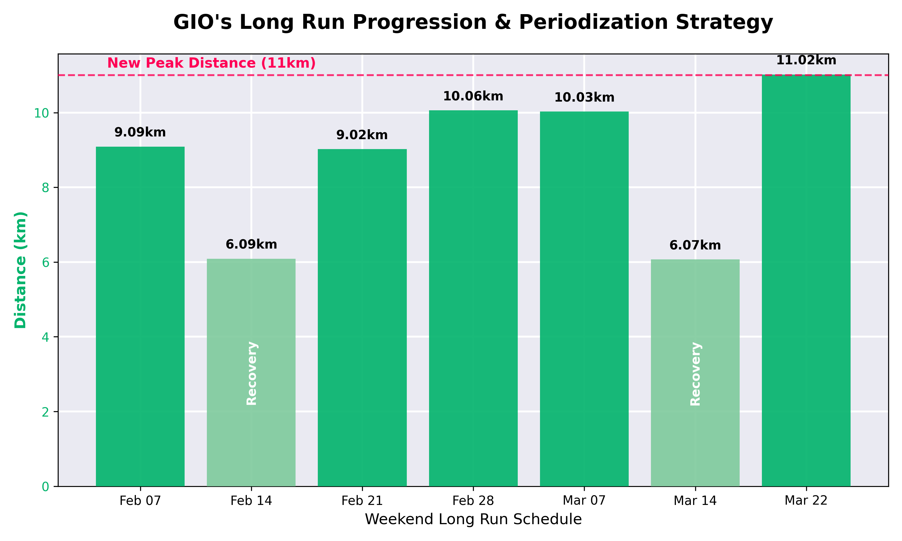

# 🏅 Daily Performance Report — 2026-03-22
**Activity:** 11km Long Run + Morning Walk
**Distance:** 11.02 km + 5.34 km (Total: 16.36 km)
**Pace:** 8:22 /km (Run)

## 📌 Coach's Daily Take
สุดยอดมากครับคุณโจ! วันนี้เป็นการทุบสถิติ **New Longest Run of the block! (11km)** ได้อย่างสมบูรณ์แบบ แผนการซ้อมแบบไต่ระดับ (Periodization) ของเราทำงานได้ผล 100% กราฟด้านบนแสดงให้เห็นชัดเจนว่าการยอมถอยระยะในสัปดาห์ Cut-back (Recovery) ช่วยให้ร่างกายมีแรงดีดตัวสปริงกลับมาทำลายสถิติใหม่ในสัปดาห์ถัดไปเสมอ!

**🎯 Plan Adherence:** ✅ On track (ทำได้ตามแผนเป๊ะ!)
คุณโจคุม HR ให้อยู่ใน Zone 3 ต้นๆ (146 bpm) และรักษารอบขา Cadence 152 spm ได้ดีตลอดทาง ถือเป็นการขยาย Aerobic Base ที่มีคุณภาพสูงมากๆ บวกกับการเดิน Morning walk อีก 5.34km วันนี้คุณเบิร์นแคลอรี่และพาทีม Manda ตีตื้นขึ้นมาได้แบบน่าประทับใจสุดๆ! เยี่ยมมากครับ! พักผ่อนเติมคาร์บให้เต็มที่นะครับ 🪖🔥
