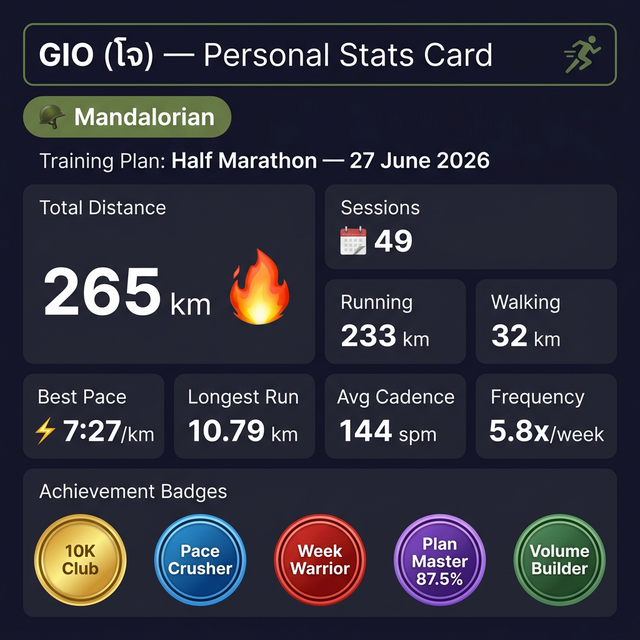
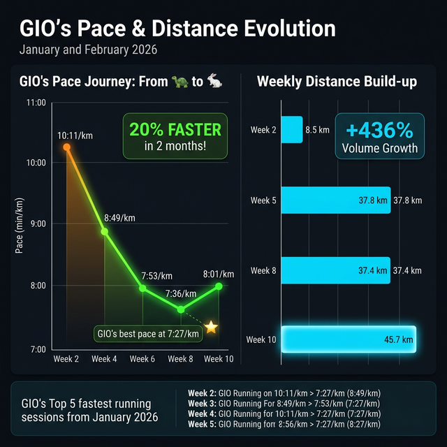
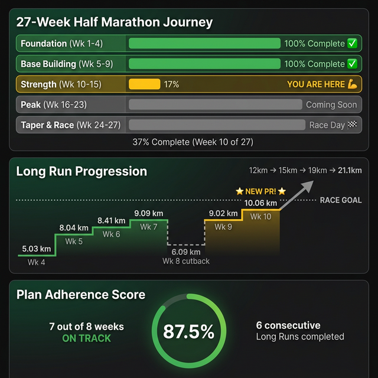
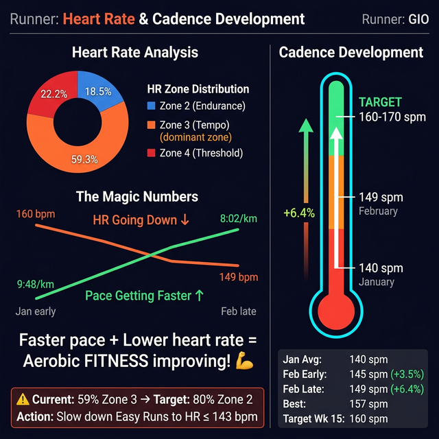
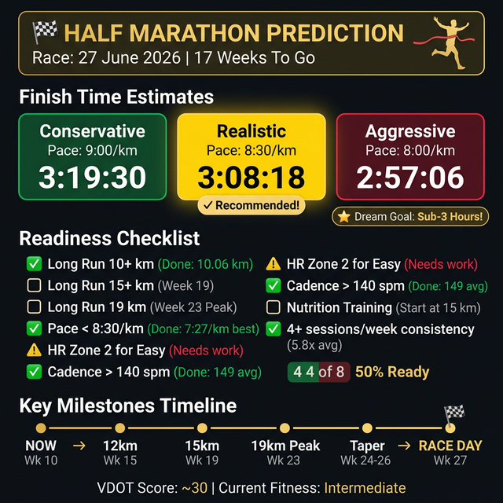

# 📋 Personal Performance Report — GIO (โจ)
📅 ช่วง: **1 มกราคม — 28 กุมภาพันธ์ 2026** (59 วัน)
🏋️ Phase: Foundation → Base Building → **💪 Strength Phase (Week 10/27)**
🏁 เป้าหมาย: **Half Marathon 21.1 km — 27 มิถุนายน 2026**

*จัดทำโดย: Running Coach AI · วันที่ 28 กุมภาพันธ์ 2026*

---

## 👤 Personal Stats Card

| เมตริก | ค่า |
|:---|:---|
| **ระยะทางรวม** | 🔥 **265.06 km** (Running 232.84 + Walk 32.22) |
| **เซสซั่นทั้งหมด** | 📋 49 ครั้ง (Running 37 + Walk 12) |
| **วันที่ออกกำลังกาย** | 📅 34/59 วัน (57.6%) |
| **ความถี่** | 📊 ~5.8 เซสซั่น/สัปดาห์ |
| **Best Pace** | ⚡ **7:27/km** — 6km Easy Run (23 ก.พ.) |
| **Longest Run** | 🏅 10.79 km — Tuesday Night Run (6 ม.ค.) |
| **Longest Long Run (Plan)** | 🏆 **10.06 km** — 10km Block Long Run (28 ก.พ.) |
| **Best Distance Day** | 🔥 14.18 km (21 ก.พ.) |
| **Avg HR** | ❤️ 150 bpm (Zone 3 Tempo) |
| **Avg Cadence** | 🦶 144 spm |

### 🏅 Achievement Badges

| Badge | Achievement | Date |
|:---|:---|:---|
| 💯 **10K Club** | วิ่ง 10+ km สำเร็จ (10.06 km, 10.79 km) | ม.ค. - ก.พ. |
| 📈 **Pace Crusher** | Pace ดีขึ้น 2:33/km (10:00 → 7:27, +20%) | ก.พ. 23 |
| 🔥 **Week Warrior** | 3+ sessions ทุกสัปดาห์ ไม่เคยขาด | Wk 3-10 |
| 💪 **Plan Master** | Plan Adherence 87.5% (7/8 weeks) | Wk 3-10 |
| 🧱 **Volume Builder** | Weekly volume 8.5 → 45.7 km (+436%) | Wk 2-10 |
| 🗓️ **Consistency King** | Active ต่อเนื่อง 9 สัปดาห์ | Wk 2-10 |
| 🌅 **Early Bird** | Morning Walk ทุกวันที่วิ่งตั้งแต่ ก.พ. | ก.พ. 7+ |
| 🌙 **Night Owl** | Tuesday Night Run 10.79 km | ม.ค. 6 |

---

## ⚡ Pace & Distance Evolution

### Pace Journey — จาก 🐢 สู่ 🐇

| ช่วง | Avg Pace | Best Pace | แนวโน้ม |
|:---|:---|:---|:---|
| ม.ค. ต้น (Wk 2-3) | 9:48/km | 8:39/km | — Baseline |
| ม.ค. กลาง (Wk 4) | 8:49/km | 7:55/km | 📈 เร็วขึ้น |
| ม.ค. ปลาย (Wk 5-6) | 8:46/km | 7:38/km | 📈 เร็วขึ้นต่อเนื่อง |
| ก.พ. ต้น (Wk 7-8) | 7:51/km | 7:29/km | 📈🔥 Breakthrough! |
| ก.พ. ปลาย (Wk 9-10) | 8:02/km | 7:27/km | 📈 PR ใหม่! |

> ⚡ **Improvement: Pace เร็วขึ้น ~20% ใน 2 เดือน!**

### Weekly Distance Build-up

| สัปดาห์ | Running (km) | Walk (km) | รวม (km) | Phase |
|:---|:---|:---|:---|:---|
| Wk 2 | 8.52 | — | 8.52 | 🏗️ Foundation |
| Wk 3 | 25.84 | — | 25.84 | 🏗️ Foundation |
| Wk 4 | 19.21 | — | 19.21 | 🏗️ Foundation |
| Wk 5 | 37.84 | — | 37.84 🔥 | 📈 Base |
| Wk 6 | 19.53 | — | 19.53 | 📈 Base |
| Wk 7 | 31.41 | 2.35 | 33.76 | 📈 Base |
| Wk 8 | 32.93 | 4.49 | 37.42 | 📈 Cut-back |
| Wk 9 | 33.93 | 9.67 | 43.60 | 💪 Strength |
| **Wk 10** | **30.00** | **15.71** | **45.71** 🔥 | **💪 Strength** |

> 📈 **Volume เพิ่มจาก 8.5 → 45.7 km/wk (+436%)**

---

## 🗓️ Training Plan & Long Run Progression

### 27-Week Journey — Overall Progress: **37% (Week 10/27)**

| Phase | สัปดาห์ | Status | Long Run |
|:---|:---|:---|:---|
| 🏗️ Foundation | Wk 1-4 | ✅ 100% Complete | 5-7 km |
| 📈 Base Building | Wk 5-9 | ✅ 100% Complete | 8-9 km |
| **💪 Strength** | **Wk 10-15** | **🔄 17% (1/6)** | **10-12 km** |
| 🔝 Peak | Wk 16-23 | 📅 Coming | 13-19 km |
| 🏁 Taper & Race | Wk 24-27 | 📅 Coming | 17→11 km |

### Long Run Staircase

| Wk | กิจกรรม | ระยะ | Pace | HR | สถานะ |
|:---|:---|:---|:---|:---|:---|
| 4 | 5km Long Run | 5.03 km | 7:55/km | 154 bpm (Z3) | ✅ |
| 5 | 8km Long Run | 8.04 km | 9:33/km | 138 bpm (Z2) | ✅🎉 First 8K! |
| 6 | 8km Progressive | 8.41 km | 7:53/km | 163 bpm (Z4) | ✅ |
| 7 | 9km Long Run | 9.09 km | 8:12/km | 162 bpm (Z4) | ✅🎉 First 9K! |
| 8 | 6km Long Run | 6.09 km | 8:43/km | 151 bpm (Z3) | ✅ Cut-back |
| 9 | 9km Long Run | 9.02 km | 9:11/km | 140 bpm (Z2) | ✅ Zone 2 ดีมาก! |
| **10** | **10km Block LR** | **10.06 km** | **8:32/km** | **148 bpm (Z3)** | **✅🔥 NEW PR!** |

> 🎉 **Long Run: 5km → 10km (+100%) ใน 6 สัปดาห์!**
> 🏆 **Plan Adherence: 87.5% — 7/8 สัปดาห์ตามแผน!**

---

## ❤️ Heart Rate & Cadence Development

### ❤️ HR Zone Distribution (27 sessions ที่มีข้อมูล)

| Zone | ชื่อ | จำนวน | % | สถานะ |
|:---|:---|:---|:---|:---|
| Zone 2 | Endurance | 5 | 18.5% | ⚠️ ต่ำเกินไป |
| **Zone 3** | **Tempo** | **16** | **59.3%** | ⚠️ สูงเกินไป |
| Zone 4 | Threshold | 6 | 22.2% | OK |

### The Magic Numbers — วิ่งเร็วขึ้น + หัวใจเต้นช้าลง!

| ช่วง | Avg HR | Avg Pace | สัญญาณ |
|:---|:---|:---|:---|
| ม.ค. ต้น | ❤️ 160 bpm | 🐢 9:48/km | ยังปรับตัว |
| ม.ค. ปลาย | ❤️ 150 bpm | 🏃 8:46/km | 📉 HR ลดลง ดี! |
| ก.พ. ปลาย | ❤️ 149 bpm | 🐇 8:02/km | 📈🔥 Fitness ↑↑ |

> 🎯 **Key Insight:** Pace เร็วขึ้น 20% + HR ลดลง 7% = **Aerobic Fitness กำลังพัฒนาชัดเจน!** 💪

### 🦶 Cadence Trend

| ช่วง | Avg Cadence | เปลี่ยนแปลง | เป้าหมาย |
|:---|:---|:---|:---|
| ม.ค. (Wk 3-6) | 140 spm | — Baseline | 160-170 spm |
| ก.พ. ต้น (Wk 7-8) | 145 spm | 📈 +3.5% | |
| ก.พ. ปลาย (Wk 9-10) | 149 spm | 📈 +6.4% | |
| **Best** | **157 spm** | | |

---

## 🏁 Race Day Prediction — Half Marathon 21.1 km

### ⏱️ Finish Time Estimates

| Scenario | Pace | Finish Time | ความเป็นไปได้ |
|:---|:---|:---|:---|
| 🟢 Conservative | 9:00/km | **3:19:30** | ✅ สบายๆ |
| 🟡 **Realistic** | **8:30/km** | **3:08:18** | ✅ น่าจะทำได้ |
| 🔴 Aggressive | 8:00/km | **2:57:06** | ⚠️ ต้องพัฒนาอีก |
| ⭐ **Dream Goal** | **≤ 8:06/km** | **Sub-3 hours!** | 🎯 ท้าทาย |

### ✅ Readiness Checklist (4/8 = 50% Ready)

| Item | Status | Detail |
|:---|:---|:---|
| Long Run 10+ km | ✅ Done | 10.06 km (28 ก.พ.) |
| Long Run 15+ km | ⬜ Pending | Week 19 (2 พ.ค.) |
| Long Run 19 km | ⬜ Pending | Week 23 (30 พ.ค.) |
| Pace < 8:30/km | ✅ Done | Best 7:27/km |
| HR Zone 2 for Easy | ⚠️ Needs Work | ปัจจุบัน 59% Zone 3 |
| Cadence > 140 spm | ✅ Done | 149 spm avg |
| Nutrition Training | ⬜ Pending | เริ่มที่ 15 km |
| Consistency 4+/wk | ✅ Done | 5.8x/wk avg |

---

## 🔮 คำแนะนำจากโค้ช (Coach's Recommendations)

### ✅ สิ่งที่ทำได้ดีแล้ว — รักษาไว้!

1. 💪 **วินัยสุดยอด** — Plan Adherence 87.5%, ไม่ขาด Long Run 6 สัปดาห์ติด
2. ⚡ **Pace พัฒนา 20%** — จาก 10:00 → 7:27/km ใน 2 เดือน
3. 📈 **Volume เพิ่มอย่างเป็นระบบ** — 8.5 → 45.7 km/wk ปลอดภัย
4. 🚶 **Morning Walk เป็น Active Recovery ที่ดีมาก** — เพิ่ม Time on Feet โดยไม่เสี่ยงบาดเจ็บ

### ⚠️ 3 จุดที่ต้องปรับปรุงทันที

#### 1. ❤️ คุม Easy Run ให้ช้าลง — เป้า HR ≤ 143 bpm (Zone 2)

ปัจจุบัน 59% ของเซสซั่นอยู่ใน Zone 3 ซึ่งหนักเกินไปสำหรับ Easy Run ตามหลัก **Polarized Training (80/20)** ควรมีเซสซั่น Zone 2 อย่างน้อย 80%

> 💡 **วิธีแก้:** ในวัน Easy Run ให้ลดความเร็วจนสามารถ "พูดคุยเป็นประโยคได้โดยไม่หอบ" คุม HR ≤ 143 bpm. อย่ากลัวช้า — **"วิ่งช้าเพื่อวิ่งเร็ว"** คือกุญแจสู่ Aerobic Base ที่แข็งแกร่ง

#### 2. 🦶 เพิ่ม Cadence ทีละน้อย — เป้า 155-160 spm ใน Wk 15

ปัจจุบัน 149 spm ยังห่างจากเป้า 160-170 spm ที่เหมาะสมสำหรับ Half Marathon

> 💡 **วิธีแก้:** โฟกัส "ก้าวสั้นลง สับเท้าเร็วขึ้น" เพิ่ม +5% ต่อ Phase (ทุก 5 สัปดาห์). ลองใช้ Metronome App ตั้งที่ 155 spm ตอน Easy Run

#### 3. 📱 ใส่ HR Monitor ทุกครั้ง

10 เซสซั่นไม่มีข้อมูล HR → เสียโอกาสวิเคราะห์ ข้อมูลที่ครบจะช่วยปรับแผนได้แม่นยำขึ้น

### 🔴 สิ่งที่ต้องเตรียมสำหรับ Phase ถัดไป

| เรื่อง | ช่วงเวลา | รายละเอียด |
|:---|:---|:---|
| 🍬 Nutrition Training | Wk 13+ (Long Run 11-13 km) | ทดลองกินเจล 1 ซอง ที่ km 6-7 |
| 🧠 Mental Prep | Wk 19+ (Long Run 15+ km) | ฝึกจิตใจสำหรับระยะที่ไม่เคยวิ่ง |
| 👟 Race Gear | Wk 20 (16 km Race Practice) | ทดสอบรองเท้า + ชุดแข่ง + เจล |
| 📊 2-Mile Time Trial | Wk 12 | ทดสอบ VDOT ปัจจุบันเพื่อปรับ Pace |

---

> 🏆 **สรุป: คุณโจ อยู่ใน ON TRACK สุดๆ ครับ!**
> ด้วยวินัย 87.5%, Pace ดีขึ้น 20%, Long Run ขยายจาก 5→10 km — ถ้ารักษาระดับนี้ไว้ **คุณโจจะวิ่งจบ Half Marathon 21.1 km ได้แน่นอนครับ!** 🔥✌️

---

[🔙 กลับไปดูสถิติทั้งหมด (Personal Statistics)](../personal-statistics.md) | [🏃🏻‍♂️ ดูแผนฝึกซ้อม (Running Plan)](../running-plan.md) | [🏠 กลับหน้าหลัก (Profile)](../README.md)

*📊 Auto-generated on 2026-02-28 by Running Coach AI*
