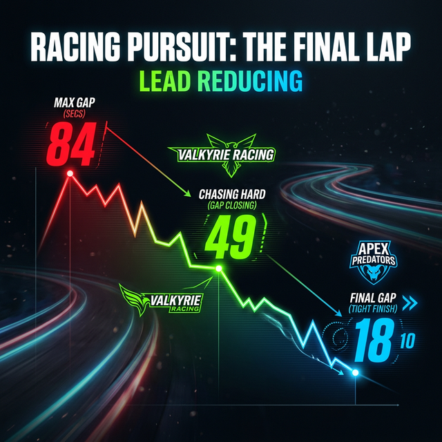

# 🎨 Custom Report: ปฏิบัติการ "ไล่ล่า" ของฝ่ายตาม (Mandalorian)
**Period Focus:** The Great Pursuit (Week 9 ➔ Week 11)

## 📉 The Weekly Gap Narrative (IT System − Mandalorian)
ช่วง 2 สัปดาห์ที่ผ่านมาคือบทพิสูจน์ความอึดของทีม Mandalorian ที่พยายามกระชากช่องว่างความห่างที่พุ่งไปถึงจุดสูงสุดใน Week 9 ให้กลับมาสูสีที่สุดอีกครั้ง!

| Week | สถานการณ์ | Gap (km) | ปริมาณที่ตีตื้นมาได้ |
| :---: | :--- | ---: | ---: |
| **W9** (22–28 Feb) | 🔴 **Peak Gap** — IT System ทิ้งห่างสุดกู่! | **+84.23 km** | — |
| **W10** (1–7 Mar) | 📉 **The Counterattack** — Manda เริ่มโต้กลับ! | +49.38 km | 🔥 หดลง **34.85 km** |
| **W11** (8–14 Mar) | 📉📉 **Close Combat** — ตามหลังแค่ก้าวเดียว! | **+18.52 km** | 🔥 หดลงอีก **30.86 km** |

> 🚨 **Total Recovery (2 Weeks):** ทีม Mandalorian สปีดไล่เก็บระยะทางคืนมาได้ทั้งหมด **65.71 km** ภายในระยะเวลาแค่ 2 สัปดาห์! จากที่ตามหลังอยู่ 84km ตอนนี้เหลือระยะห่างแค่ **1.85 km ต่อคน** เท่านั้น!

---

## 💥 Key Moments: ทำไม Manda ถึงตามมาได้ขนาดนี้?

### 1. 🪖 พลัง Long Run ของ GIO
GIO (Manda-1) คือหัวหอกทะลวงฟันอย่างแท้จริง แค่ในสัปดาห์ที่ W10 และ W11 เขากดระยะรวมทะลุ 381.72 km (รวมทั้งการทำ Long Run 10km และเบิ้ล 2 Session ต่อวัน!) เรียกว่าเป็นเครื่องจักรเก็บระยะที่ทำให้ IT System ต้องเสียวสันหลัง

### 2. 🪖 กองกำลังหนุนที่สม่ำเสมอ
ความต่อเนื่องของสมาชิกทีมคนอื่นๆ โดยเฉพาะ Sand (Manda-5) ที่ช่วยสะสมระยะอย่างสม่ำเสมอ ทำให้ทีม Manda มีฐานระยะทางที่แน่นพอจะไล่บี้หัวตาราง

### 3. 💻 ป้อมปราการที่แข็งแกร่งของ IT System
แม้จะโดนไล่กวดอย่างหนัก แต่ IT System ก็ยังยึดจ่าฝูงไว้ได้! ต้องขอบคุณความอึดของ **Jojo (192.78 km), O (144.91 km)** และการฮึดสู้ของ **Boy (127.53 km)** ที่ช่วยตรึงระยะห่างไม่ให้ขาดหายไป การอัด Long Run วันนี้ (8.23km) ของ Boy คือตัวอย่างของการ Defense ที่ยอดเยี่ยมเพื่อปกป้องตำแหน่งไว้!

---

## 🔮 บทสรุปของโค้ช: The Final Sprint
เหลือเวลาอีกเพียง **17 วัน** จะจบ Q1 การแข่งขันที่เคยมองเห็นผู้ชนะชัดเจนใน Week 9 ตอนนี้กลับมา **"ใครพลาด คนนั้นแพ้"** ช่องว่าง 18.52 km รวม (หรือ 1.85 km/คน) สามารถพลิกกลับได้ภายใน **"วันเดียว"** เท่านั้น 

เสาร์-อาทิตย์นี้อาจเป็นตัวตัดสินแชมป์ของ Q1 2026! ใครจะอยู่ ใครจะไป!? 🔥

---

### 🎨 Visual Prompt for Infographic Generation
**Style:** Cinematic, action-oriented data visualization. Look and feel of an adrenaline-pumping esports or F1 broadcast.
**Composition:** 
- A large, dramatic declining bar chart showing the gap dropping from 84.23km ➔ 49.38km ➔ 18.52km.
- Text accents in bright neon colors (Red for Peak Gap, Green/Olive for Manda's comeback, Blue/Cyan for IT's defense).
- Background should be dark, perhaps with a subtle motion-blur effect or running track lines fading into the distance to imply the "chase."

