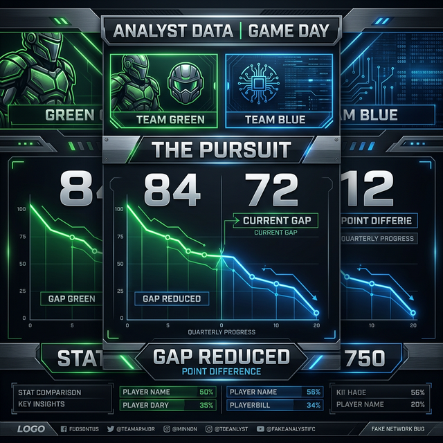

# 🎨 Custom Sports Analyst Infographic: The Great Pursuit
**Date Generated:** 2026-03-14

## The Weekly Narrative
การไล่ล่าแบบไม่คิดชีวิตของทีม **Mandalorian** ตลอดช่วง 2 สัปดาห์ที่ผ่านมา ได้กลายเป็นไฮไลท์สำคัญที่สุดในภาพรวมสถิติของ Quarter 1 ปี 2026! ดูกราฟและตัวเลขการบีบช่องว่างอย่างบ้าคลั่งนี้:

| จุดอ้างอิงสถานะ | ข้อมูลทีม |
|---|---|
| 🚨 **จุด Peak (Week 9)** | IT System นำสูงสุดที่ +84 km |
| 🔥 **การโต้กลับ (Week 10-11)** | Mandalorian บีบระยะลงมาถึง 72 km |
| 🪖 **ปัจจุบัน (Week 11 - 14 ล่าสุด)** | ช่องว่างเหลือเพียง 12.79 km (+1.28 km/person) |

นี่คือสัปดาห์ที่ลุ้นระทึกที่สุด! ใครจะเข้าเส้นชัยในสัปดาห์นี้!?

## 🖼️ Visual Data File 
ทีม Analyst ได้ทำการประมวลผล Layout สรุปตัวเลขดังกล่าว และ Render ภาพกราฟิกให้อยู่ในฟอร์แมตแนวตั้ง เรียบร้อยแล้ว

## Recommendation 
แนะนำให้นำภาพนี้ไปลงใน Line Group เพื่อกระตุ้นความฮึกเหิมของฝั่งผู้ตาม (Mandalorian) และปลุกฝั่งผู้นำ (IT System) ให้ลุกขึ้นมาวิ่งหนี!
