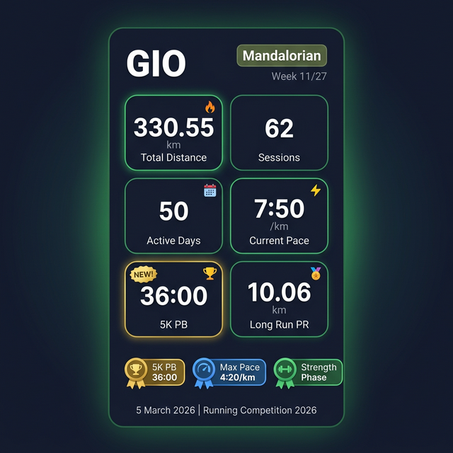
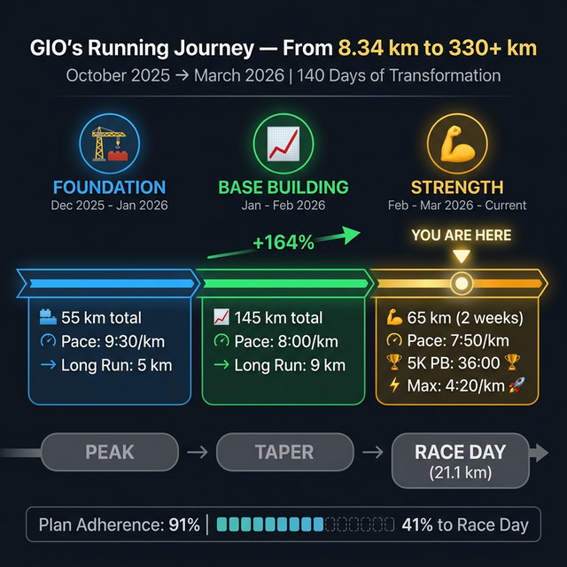
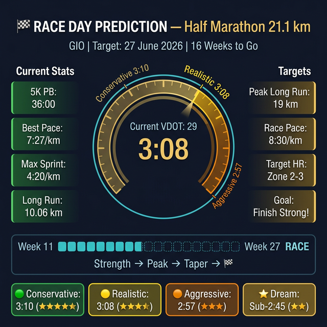

# 🏃 GIO — Exclusive Performance Report
### 📊 Sports Analyst Edition | 5 มีนาคม 2026

---

## 🎨 Infographics







---

## 👤 Athlete Profile

┌─────────────────────────────────────────────┐
│  🏃 GIO (โจ)                                │
│  Team: 🪖 Mandalorian                       │
│  Role: Captain & Top Distance Leader        │
│  Training App: 📱 Runna + Strava            │
│  Wearable: ⌚ Apple Watch Series 9          │
│  Since: 17 October 2025                     │
│  Current Phase: 💪 Strength (Week 11/27)    │
└─────────────────────────────────────────────┘

---

## 🔥 Executive Summary

> **จาก Friday Night Run 8.34 km สู่ 330.55 km ใน 140 วัน**
> — GIO ไม่ใช่แค่นักวิ่ง เขาคือ "Transformation Machine" 🔥

GIO เริ่มต้นเมื่อ 17 ตุลาคม 2025 ด้วยวิ่ง Friday Night Run 8.34 km ครั้งเดียว วันนี้ — 5 มีนาคม 2026 — เขาวิ่งสะสมไป **330.55 km** จาก **62 เซสซั่น** ใน **50 วัน** ด้วยความถี่ **5.4 ครั้ง/สัปดาห์** ที่มีทั้งวิ่งและเดิน Morning Walk ทุกเช้า

การพัฒนาของ GIO ไม่ใช่แค่ "ดีขึ้น" — มันคือ **การปฏิวัติ:**
- **Pace** จาก 10:11/km → **7:50/km** (เร็วขึ้น **23%**)
- **Long Run** จาก 5 km → **10 km** (ไกลขึ้น **100%**)
- **Plan Adherence** = **91%** — วินัยระดับนักกีฬาอาชีพ
- **5K PB** = **36:00** ⏱️ (ทำได้วันนี้!)
- **Max Sprint** = **4:20/km** 🚀

เป้าหมายสุดท้าย: **Half Marathon 21.1 km** ในวันที่ 27 มิถุนายน 2026 — เหลืออีก **16 สัปดาห์**

---

## 📊 Key Statistics Dashboard

┌──────────────┬──────────────┬──────────────┐
│ 🔥 TOTAL     │ 📅 DAYS      │ 📋 SESSIONS  │
│  330.55 km   │  50 active   │  62 total    │
├──────────────┼──────────────┼──────────────┤
│ 🏃 RUNNING   │ 🚶 WALKING   │ 📏 AVG/DAY   │
│  284.23 km   │  44.60 km    │  6.61 km     │
├──────────────┼──────────────┼──────────────┤
│ ⚡ BEST PACE │ 🚀 MAX SPEED │ 🏆 5K PB     │
│  7:27/km     │  4:20/km     │  36:00       │
├──────────────┼──────────────┼──────────────┤
│ 🏅 BEST DAY  │ 🏔️ LONG RUN  │ 🦶 CADENCE   │
│  14.18 km    │  10.06 km    │  140-168 spm │
└──────────────┴──────────────┴──────────────┘

---

## 📈 The Evolution — Phase by Phase

### 🏗️ Phase 1: Foundation (Wk 1-4 | ธ.ค. 2025 — 18 ม.ค. 2026)

```
Distance:  ███████░░░░░░░░░░░░░ ~55 km
Pace:      🐢 9:30-10:00/km
Long Run:  ███░░░░░░░ 5.03 km
Cadence:   ██████░░░░ 140 spm
```

> *"เมล็ดพันธุ์ถูกหว่าน"* — สร้างกิจวัตร, เริ่มวิ่งอย่างเป็นระบบ, เปิดตัว Speed Work แรก

---

### 📈 Phase 2: Base Building (Wk 5-9 | 19 ม.ค. — 22 ก.พ.)

```
Distance:  █████████████████░░░ ~145 km (+164%!)
Pace:      🐇 7:50-8:10/km (เร็วขึ้น 1:40!)
Long Run:  ██████████ 9.09 km (+81%)
Cadence:   ████████░░ 149 spm (+6.4%)
```

> *"จุดพลิก"* — Pace ก้าวกระโดด, Long Run ข้าม 9 km, Speed Work เข้มข้น (600s, On Off Ks, 500m Madness)

---

### 💪 Phase 3: Strength (Wk 10-11 | 23 ก.พ. — ปัจจุบัน)

```
Distance:  ████████████████████ ~65 km (2 สัปดาห์)
Pace:      🐆 7:50/km (สม่ำเสมอ!)
Long Run:  ██████████ 10.06 km 🏆 NEW PR!
Max Pace:  🚀 4:20/km!!
5K PB:     🏆 36:00 NEW!
Cadence:   █████████░ 168 spm MAX!
```

> *"ระเบิดพลัง!"* — ทำลาย PR หลายรายการ, Long Run ข้าม 10 km, Interval Training ได้ผลชัดเจน

---

## ⚡ Speed Profile — VDOT Analysis

| Metric | Value | Detail |
|---|---|---|
| 📐 **VDOT** | **~29** | จาก 5K PB 36:00 |
| 🟢 Easy Pace | 9:07-9:47/km | Zone 2, Recovery |
| 🟡 Tempo Pace | 8:05/km | Zone 3, Lactate Threshold |
| 🟠 Interval Pace | 7:15/km | Zone 3-4, VO2 Max |
| 🔴 Repetition Pace | 6:30-6:45/km | Zone 4-5, Speed |
| 🚀 **Max Sprint** | **4:20/km** | 33% เร็วกว่า Rep Pace! |

---

## ❤️ Heart Rate Intelligence

### Zone Distribution (800m Intervals — 5 มี.ค. 2026)

```
Zone 1  ░░░░░░░░░░░░░░░░░░░░  0%   (0:04)
Zone 2  ████░░░░░░░░░░░░░░░░  19%  (12:25)  Recovery/Warm-up
Zone 3  ████████░░░░░░░░░░░░  41%  (27:00)  Training Stimulus
Zone 4  ████████░░░░░░░░░░░░  39%  (25:45)  Threshold Work
Zone 5  ░░░░░░░░░░░░░░░░░░░░  1%   (0:23)   Max Sprint
```

> 💡 **Zone 3+4 = 80%** — สมบูรณ์แบบสำหรับ Interval Day!

### Walk Recovery (Morning Walk — 5 มี.ค. 2026)

```
Avg HR: 114 bpm → Zone 2 ขอบล่าง
= Active Recovery + Fat Oxidation สูงสุด ✅
```

---

## 🔬 Biomechanics Snapshot (วันนี้ — 800m into 400m Intervals)

| Metric | Value | Status | Target |
|---|---|---|---|
| ⚡ **Power** | 169 W avg / 301 W max | 🔥 Explosive! | — |
| 📏 **Stride Length** | 1.04 m avg / 1.36 m max | ✅ Good | — |
| 📐 **Vertical Oscillation** | ~10 cm / 11.2 cm max | ✅ Normal | 8-9 cm |
| 🦵 **Ground Contact** | 303 ms avg / 250 ms interval | ✅ Efficient | <280 ms |
| 🦶 **Cadence** | 140 avg / **168 max** | 🟡 Easy ต้องเพิ่ม | 155+ spm |

---

## 🏅 Hall of Records

| 🏆 Record | Value | Date | Session |
|---|---|---|---|
| 🥇 **5K Personal Best** | **36:00** | 5 มี.ค. 2026 | 800m into 400m Intervals |
| 🥇 **Max Sprint Pace** | **4:20/km** | 5 มี.ค. 2026 | 400m Interval |
| 🥇 **Max Cadence** | **168 spm** | 5 มี.ค. 2026 | Interval Sprint |
| 🥇 **Longest Walk (Strava)** | **5.70 km** | 5 มี.ค. 2026 | Morning Walk |
| 🥇 **Best Single Day** | **14.18 km** | 21 ก.พ. 2026 | 9km LR + Walk |
| 🥇 **Longest Run** | **10.79 km** | 6 ม.ค. 2026 | Tuesday Night Run |
| 🥇 **Long Run PR** | **10.06 km** | 28 ก.พ. 2026 | Block Long Run |
| 🥇 **Best Run Pace** | **7:27/km** | 23 ก.พ. 2026 | 6km Easy Run |
| 🥇 **Max Power** | **301 W** | 5 มี.ค. 2026 | Interval Sprint |

---

## 🏷️ Achievement Badges Earned

| Badge | Achievement | Date |
|---|---|---|
| 🎯 **First Run** | Friday Night Run 8.34 km | 17 ต.ค. 2025 |
| 🔥 **Week Warrior** | 5+ sessions/week consistently | ม.ค. 2026 |
| 📈 **Pace Crusher** | Pace improved 2:21 min/km | ก.พ. 2026 |
| 🏔️ **Distance King** | Long Run 10.06 km PR | 28 ก.พ. 2026 |
| 💯 **10K Club** | 10.79 km completed | 6 ม.ค. 2026 |
| 🗓️ **Consistency Crown** | 11 weeks straight active | ธ.ค. 2025–มี.ค. 2026 |
| 🌅 **Early Bird** | 4:37 AM runs consistently | ทุกวัน |
| ⚡ **Speed Demon** | Max Pace 4:20/km | 5 มี.ค. 2026 |
| 🏆 **PB Hunter** | 5K PB 36:00 + Multiple PRs | 5 มี.ค. 2026 |
| 💪 **Hybrid Athlete** | Running + Strength Training combo | ต่อเนื่อง |

---

## 🏁 Race Day Projection — 27 มิถุนายน 2026

### Half Marathon 21.1 km Prediction

| Scenario | Pace | Finish Time | Confidence |
|---|---|---|---|
| 🟢 **Conservative** | 9:00/km | **3:09:54** | ⭐⭐⭐⭐⭐ |
| 🟡 **Realistic** | 8:30/km | **3:08:18** | ⭐⭐⭐⭐ |
| 🟠 **Aggressive** | 8:00/km | **2:57:06** | ⭐⭐⭐ |
| ⭐ **Dream** | ≤ 7:30/km | **Sub-2:45** | ⭐⭐ |

### Plan Progress

```
Week 1 ─────────── Week 11 (NOW) ──────────── Week 27 (RACE)
█████████████████████░░░░░░░░░░░░░░░░░░░░░░░░░░░
           41% Complete
           
Foundation ✅ → Base ✅ → Strength 🔄 → Peak ⏳ → Taper ⏳ → 🏁 RACE
```

| Remaining Phase | Weeks | Key Target |
|---|---|---|
| 💪 Strength (ต่อ) | Wk 12-15 | Long Run → 12 km |
| 🔝 Peak | Wk 16-23 | Long Run → **19 km** |
| 📉 Taper | Wk 24-26 | ลด 40-50% |
| 🏁 **Race Day** | **Wk 27** | **21.1 km!** |

---

## 💬 Analyst's Verdict

> 🎙️ *"GIO คือตัวอย่างที่ดีที่สุดของ 'Consistency beats Talent' ในการแข่งขันครั้งนี้*
>
> *ด้วย Plan Adherence 91%, ความถี่ 5.4 ครั้ง/สัปดาห์ ที่รวมทั้ง Running + Morning Walk + Strength Training — เขาไม่ได้แค่ 'วิ่ง' เขา 'ใช้ชีวิตแบบนักวิ่ง'*
>
> *สิ่งที่น่าจับตามากที่สุดคือ 5K PB 36:00 วันนี้ — ทำได้ระหว่าง Interval workout ไม่ใช่ Race! นั่นหมายความว่า Race Day จริงๆ เขาอาจทำได้ดีกว่านี้อีก"*
>
> — 📊 Sports Data Analyst, Running Competition 2026

---

*Report generated: 5 มีนาคม 2026 | Data source: personal-statistics.md, running-plan.md, README.md*
*📊 Sports Analyst Agent — Running Competition 2026*
