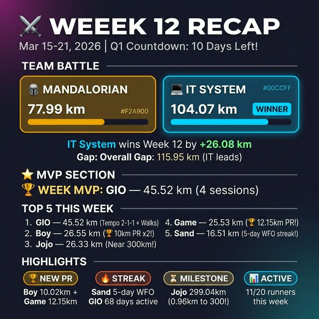

# 📅 Week 12 Recap — Running Competition 2026

> **Period:** 15–21 March 2026 | **Q1 Countdown:** 10 Days Left! ⏳  
> **Data Source:** `results/2026-March.csv` | ✅ Cross-check complete — 11 active members verified

---

## ⚔️ Team Battle — Week 12

| Metric | 🪖 Mandalorian | 💻 IT System | Diff |
| :--- | ---: | ---: | ---: |
| **Week Distance** | 77.99 km | 104.07 km | +26.08 km 💻 |
| **Active Members** | 6 / 10 | 8 / 10 | |
| **Sessions** | 14 | 14 | |
| **Q1 Total** | 724.94 km | 840.89 km | +115.95 km 💻 |
| **Q1 Avg/Person** | 72.49 km | 84.09 km | +11.59 km 💻 |

> 💻 **IT System wins Week 12** by **+26.08 km** — Boy's double 10km PR and Game's 12.15km PR made the difference!

---

## 🏆 Week MVP: GIO — 45.52 km (4 sessions)

GIO ครองตำแหน่ง MVP อีกสัปดาห์ ด้วย Tempo 2-1-1 จาก Half Marathon Plan Week 13 + Morning Walk ทุกวัน!

---

## 🌟 Top 5 This Week

| Rank | Name | Team | Week Distance | Sessions | Highlight |
| :---: | :--- | :--- | ---: | :---: | :--- |
| 🥇 | **GIO** | 🪖 Manda | 45.52 km | 4 | Tempo 2-1-1 + Pyramid Set |
| 🥈 | **Boy** | 💻 IT | 26.55 km | 3 | 🏆 **10km PR x2!** Strava Longest Run! |
| 🥉 | **Jojo** | 💻 IT | 26.33 km | 3 | 10K Outdoor + Indoor Walk (299.04km total!) |
| 4 | **Game** | 💻 IT | 25.53 km | 3 | 🏆 **12.15km NEW PR!** |
| 5 | **Sand** | 🪖 Manda | 16.51 km | 5 | 🔥 WFO 5-day streak! |

---

## 📊 Activity Feed — Week 12

| Date | 🪖 Mandalorian | 💻 IT System |
| :--- | :--- | :--- |
| **Sat 15** | GIO: Sunday Run 6.78km + Walk 3.32km | Mos: Walk 2.03km, Fuse: Run 8.21km | Boy: Morning Run 6.52km, Jojo: Walk 11.69km |
| **Sun 16** | GIO: Easy Run 6.06km + Walk 3.42km, Sand: WFO #5 3.50km | Oum: Treadmill 4.82km, Game: Indoor Run 5.15km, Oat: Walk 3.07km |
| **Mon 17** | GIO: Pyramid Set 9.10km + Walk 5.20km, Boat: Run 5.72km, Sand: WFO #6 4.52km | Game: Indoor Run **12.15km 🏆 PR!**, Oum: Treadmill 4.41km, O: Run 6.10km, Jojo: Outdoor Run 10.01km |
| **Tue 18** | Sand: WFO #7 2.14km | Oat: Walk 4.06km |
| **Wed 19** | Sand: WFO #8 3.05km | Game: Indoor Run 8.23km |
| **Thu 20** | GIO: Tempo 2-1-1 7.94km + Walk 3.70km, Sand: WFO #9 3.30km | Oat: Walk 3.20km, Jojo: Walk 4.63km, Boy: Morning Run **10.01km 🏆 PR!** |
| **Fri 21** | — | Boy: Morning Run **10.02km 🏆 PR!** (Strava Longest!) |

---

## 🏅 Week 12 Highlights

### 🏆 New Personal Records
| Member | Old PR | **New PR** | Δ |
| :--- | ---: | ---: | ---: |
| **Boy** | 8.23 km | **10.02 km** | **+1.79 km (+21.7%)** |
| **Game** | 8.23 km | **12.15 km** | **+3.92 km (+47.6%)** |

### 🔥 Streaks & Consistency
- **Sand** — WFO 5-day streak (WFO #5-#9, Mar 16-20) 🔥
- **GIO** — 68 active days (Overall #1!) 🗓️
- **Jojo** — 47 active days (Overall #2!) 🗓️

### ⏳ Milestone Watch
| Member | Current | Milestone | Remaining |
| :--- | ---: | ---: | ---: |
| **Jojo** | 299.04 km | **300 km** | 0.96 km! 🔥 |
| **Sand** | 93.05 km | **100 km** | 6.95 km |
| **Boy** | 154.08 km | **150 km** | ✅ **ACHIEVED!** |
| **GIO** | 432.97 km | **450 km** | 17.03 km |

---

## 🪖 Mandalorian — Contribution Breakdown

| Member | Week Distance | Contribution % | Sessions |
| :--- | ---: | ---: | :---: |
| **GIO** 🥇 | 45.52 km | 58.4% | 4 |
| **Sand** | 16.51 km | 21.2% | 5 |
| **Fuse** | 8.21 km | 10.5% | 1 |
| **Boat** | 5.72 km | 7.3% | 1 |
| **Mos** | 2.03 km | 2.6% | 1 |
| Peck | 0 km | 0% | 0 |
| Neung | 0 km | 0% | 0 |
| EM | 0 km | 0% | 0 |
| Toro | 0 km | 0% | 0 |
| Chan | 0 km | 0% | 0 |
| **Total** | **77.99 km** | **100%** | **12** |

> ⚠️ **Alert:** GIO แบกทีมคนเดียว 58.4%! Manda ต้องการคนอื่นช่วยเร่ง!

---

## 💻 IT System — Contribution Breakdown

| Member | Week Distance | Contribution % | Sessions |
| :--- | ---: | ---: | :---: |
| **Boy** 🥈 | 26.55 km | 25.5% | 3 |
| **Jojo** 🥉 | 26.33 km | 25.3% | 3 |
| **Game** | 25.53 km | 24.5% | 3 |
| **Oat** | 10.33 km | 9.9% | 3 |
| **Oum** | 9.23 km | 8.9% | 2 |
| **O** | 6.10 km | 5.9% | 1 |
| Tae | 0 km | 0% | 0 |
| Palm | 0 km | 0% | 0 |
| Ton | 0 km | 0% | 0 |
| PAN | 0 km | 0% | 0 |
| **Total** | **104.07 km** | **100%** | **15** |

> 💪 **IT กระจายแรงดี!** Top 3 (Boy, Jojo, Game) แบ่งเท่าๆ กัน ~25% คนละ!

---

## 🎙️ Coach's Corner

> **สัปดาห์นี้เป็นสัปดาห์แห่ง PR ของทีม IT!** Boy ทะลุ 10km ได้ 2 วันรวด และ Game ทำ PR 12.15km ที่น่าทึ่ง!
>
> ฝั่ง Mandalorian, GIO ยังคงเป็น one-man army ด้วย 58.4% ของทีม ส่วน Sand สร้าง WFO 5-day streak ที่น่าชื่นชม!
>
> **⚠️ เหลืออีก 10 วันจบ Q1!** Gap ที่ 115.95km ดูยากที่ Manda จะตามทัน แต่ยังมี 2 สัปดาห์เต็ม — อะไรก็เกิดขึ้นได้!
>
> **CTA:** 📣 สมาชิกที่ยังไม่ได้ส่งผลสัปดาห์นี้ → ลุกขึ้นมาวิ่ง/เดินวันนี้! ทุก km มีค่า! 🏃‍♂️💨

---

*Generated by Sports Analyst Agent — 2026-03-21 15:30*
