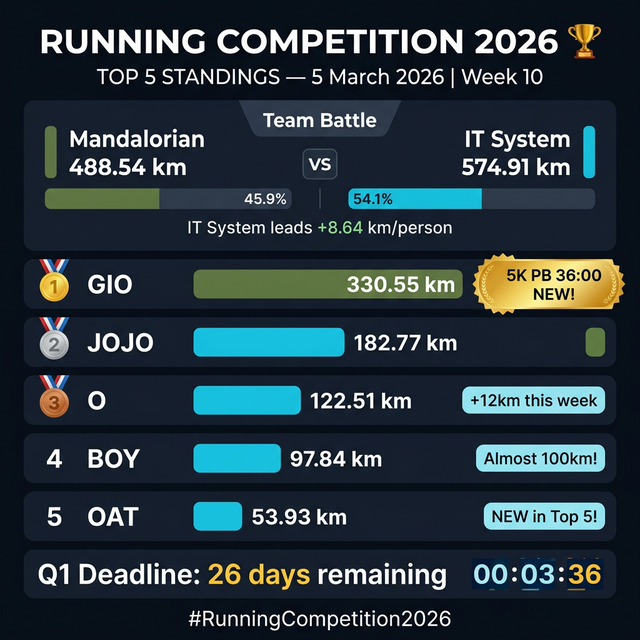

# 📣 Top 5 Daily Report — 5 มีนาคม 2026

## 🏆 Week 10 | Q1 เหลืออีก 26 วัน!



---

┏━━━━━━━━━━━━━━━━━━━━━━━━━━━━━━━━━━━━━━━━┓
┃  🏆 RUNNING COMPETITION 2026             ┃
┃  📅 5 มีนาคม 2026 — Week 10              ┃
┗━━━━━━━━━━━━━━━━━━━━━━━━━━━━━━━━━━━━━━━━┛

### ⚔️ TEAM STANDINGS
━━━━━━━━━━━━━━━━━━━━━━━━━━━━━━━━━━
💻 IT System    **574.91 km**  (avg 57.49 km/คน)
🪖 Mandalorian  **488.54 km**  (avg 48.85 km/คน)
━━━━━━━━━━━━━━━━━━━━━━━━━━━━━━━━━━
📊 Lead: 💻 IT System **+8.64 km/คน**

> 🪖 แต่เดือน **มีนาคม** → Mandalorian กลับมาเป็นผู้นำ!
> Manda: **62.46 km** vs IT: **50.61 km** 🔥

---

### 🏅 TOP 5 INDIVIDUAL RANKING
━━━━━━━━━━━━━━━━━━━━━━━━━━━━━━━━━━━━━━━━

| Rank | Runner | Distance | Team | Days | Highlight |
|:---:|:---|---:|:---|:---:|:---|
| 🥇 | **GIO** | **330.55 km** | 🪖 Mandalorian | 50 | 🔥 5K PB 36:00 วันนี้! |
| 🥈 | **Jojo** | **182.77 km** | 💻 IT System | 36 | 💪 สม่ำเสมอทุกวัน |
| 🥉 | **O** | **122.51 km** | 💻 IT System | 21 | 📈 +12 km สัปดาห์นี้! |
| 4️⃣ | **Boy** | **97.84 km** | 💻 IT System | 16 | 🎯 ใกล้ 100 km แล้ว! |
| 5️⃣ | **Oat** | **53.93 km** | 💻 IT System | 10 | 🆕 ขึ้น Top 5 ใหม่! |

━━━━━━━━━━━━━━━━━━━━━━━━━━━━━━━━━━━━━━━━

### 📊 Gap Analysis — ห่างกันแค่ไหน?

```
🥇 GIO     ████████████████████████████████████ 330.55 km
🥈 Jojo    ██████████████████░░░░░░░░░░░░░░░░░░ 182.77 km  (-147.78)
🥉 O       ████████████░░░░░░░░░░░░░░░░░░░░░░░░ 122.51 km  (-60.26)
4. Boy     ██████████░░░░░░░░░░░░░░░░░░░░░░░░░░  97.84 km  (-24.67)
5. Oat     █████░░░░░░░░░░░░░░░░░░░░░░░░░░░░░░░  53.93 km  (-43.91)
```

---

## 🔥 ไฮไลท์วันนี้

### 👑 MVP ประจำวัน: GIO 🪖
> วันเดียว **14.06 km!** (วิ่ง 8.36 km + เดิน 5.70 km)
> 🏆 ทำ **5K PB 36:00** ระหว่าง 800m→400m Intervals!
> 🚀 Max Pace พุ่งถึง **4:20/km!**
> 🦶 Cadence สูงสุด **168 spm!**
>
> *"ฝึก Interval แต่ได้ PB มาเป็นของแถม!"* 🔥

### 📈 Ones to Watch

| Runner | ทำไมต้องจับตา? |
|---|---|
| **Boy** 💻 | อีกแค่ **2.16 km** จะถึง **100 km Club!** 🎯 |
| **Oat** 💻 | เพิ่งขึ้น Top 5 แทน Palm! **Newcomer Alert!** 🆕 |
| **O** 💻 | เงียบๆ แต่ **+12 km** สัปดาห์เดียว! 📈 |
| **Sand** 🪖 | อันดับ 6 ที่ **50.44 km** — ไล่ Oat อยู่! ⚔️ |

---

## 🎯 สถิติที่น่าสนใจ

| 🏃 Fun Fact | |
|---|---|
| 🌍 รวมทุกคนวิ่งไปแล้ว | **1,063.45 km** = กรุงเทพฯ → เชียงใหม่ แล้วกลับมาอีก! |
| 👟 ก้าวรวมประมาณ | **~1,330,000 ก้าว** |
| 📅 Q1 เหลืออีก | **26 วัน** (ถึง 31 มี.ค.) |
| 🏆 GIO วิ่งคนเดียว | **31.1%** ของระยะทั้ง Competition! |
| 💻 IT System | ครอง **4 ใน 5** อันดับแรก |
| 🪖 Mandalorian | แต่ **มีนาคมนำ!** Manda: 62 vs IT: 50 km 🔥 |

---

## 💬 สรุปจาก Reporter

> 🎙️ *"สัปดาห์ที่ 10 เข้าสู่ช่วงที่ร้อนแรงที่สุดของ Q1!*
>
> *GIO ยังคงนำห่างทิ้งที่อันดับ 1 ด้วย 330 km ที่ไม่มีใครตามทัน — วันนี้ทำ 5K PB 36:00 อีก!*
>
> *แต่สิ่งที่น่าจับตาคือ **Mandalorian กลับมานำในเดือนมีนาคม!** หลังจากแพ้ทั้ง ม.ค. และ ก.พ. ครั้งนี้ Manda กดไป 62.46 km vs IT แค่ 50.61 km — ลมเปลี่ยนทิศ?*
>
> *Boy อีกนิดเดียวจะถึง 100 km Club, Oat ขึ้น Top 5 เป็นครั้งแรก, และ Sand ไล่ตามมาติดๆ ที่อันดับ 6!*
>
> *26 วันสุดท้ายของ Q1 — ทุกก้าวตัดสิน! สู้ๆ ทุกคน!"* 💪🔥

---

📢 **Q1 Deadline: 31 มีนาคม 2026, 23:59**
ทุกก้าว ทุกกิโล = คะแนนให้ทีม!

#RunningCompetition2026 #MandaloianVsITSystem #ทุกก้าวมีค่า #Week10 🏃‍♂️🔥
